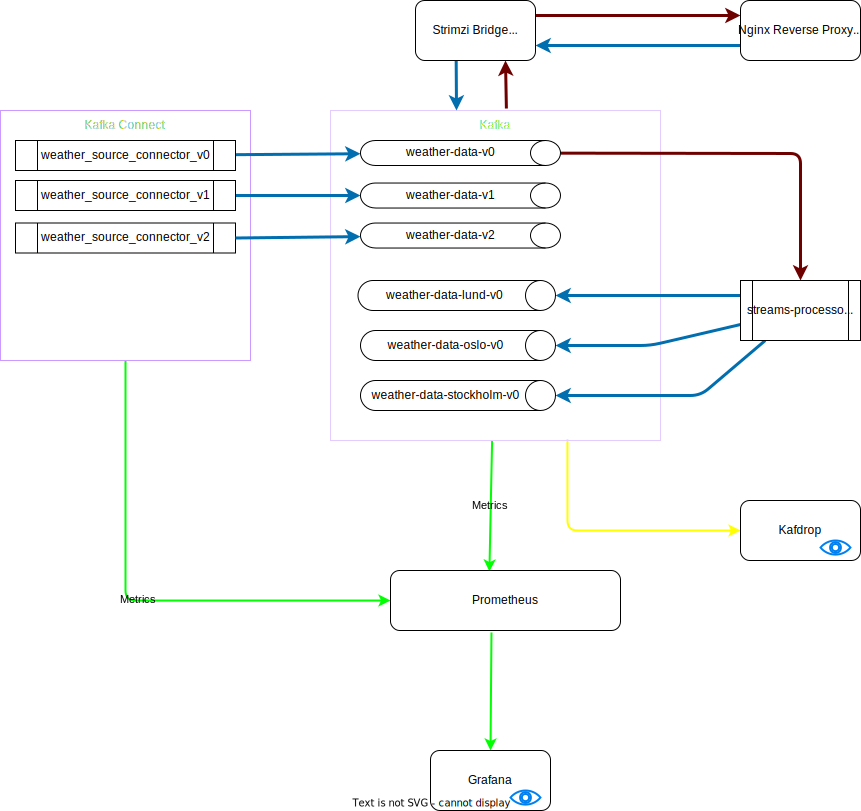

# Strimzi Playground



## Knowledge
1. [What is Kafka?](./docs/KAFKA.md)
2. [Kafka Flavors](./docs/FLAVORS.md)
3. [What is Strimzi?](https://strimzi.io/)
4. [Key configurations for Kafka, Connect and Zookeeper](./docs/KEY-CONFIGS.md)
5. [Monitoring and Alerting](./docs/MONITORING-ALERTING.md)
6. [How Kafka Works](./docs/HOW-KAFKA-WORKS.md)
7. [Design Patterns](./docs/DESIGN-PATTERNS.md)


## Deployent Steps:

### What are places that you should mention the Strimzi/Kafka versions?
1. [Kafka Connect Dockerfile](build-connect/Dockerfile)
2. [Helm chart parent values file](helm-charts/values.yaml)

### Todo
1. Prerequesties: Kubernetes Cluster / Kubectl 
2. create a new namespace in the k8s
   ```bash
   kubectl create namespace kafka
   ```
3. install strimzi operator in the cluster/namespace
   ```bash
   kubectl create -f 'https://strimzi.io/install/latest?namespace=kafka' -n kafka
   ```
4. install the prometheus operators.
   ```bash
   kubectl create -f https://raw.githubusercontent.com/prometheus-operator/prometheus-operator/master/bundle.yaml -n kafka
   ```
5. install ingress controller
   ```bash
   kubectl apply -f https://raw.githubusercontent.com/kubernetes/ingress-nginx/controller-v1.3.0/deploy/static/provider/cloud/deploy.yaml
   ```
6. Add the following to the end of your `/etc/hosts` file
   ```bash
   sudo nano /etc/hosts
   ```
   ```txt
   127.0.0.1     strimzi.bridge.local
   ```
7. [Optional] build the kafka connect docker image. If you don't build - it will pull the mentioned Kafka Connect version.
   ```bash
   cd apps/kafka-plugins/connectors/weatherapi-connector
   make
   cd <build-connect>
   ```
   Now, Change the Dockerfile (base Kafka verison) and Makefile(DOCKER_TAG, DOCKER_VERSION_ARG) based on your need. 
   ```bash
   make
   ```
8. [Optional] Build docker images for the producer, consumer and other utility applications
9. Deploy the helm chart
    ```bash
    cd helm-charts
    make
    ```
10. In case if you got lots of Evicted pods:
    ```bash
    kubectl get pod -n kafka | grep Evicted | awk '{print $1}' | xargs kubectl delete pod -n kafka
    ```
11. When you are finished, you can uninstall the entire deployment with the following:
    ```bash
    helm uninstall demo-kafka -n kafka
    ```