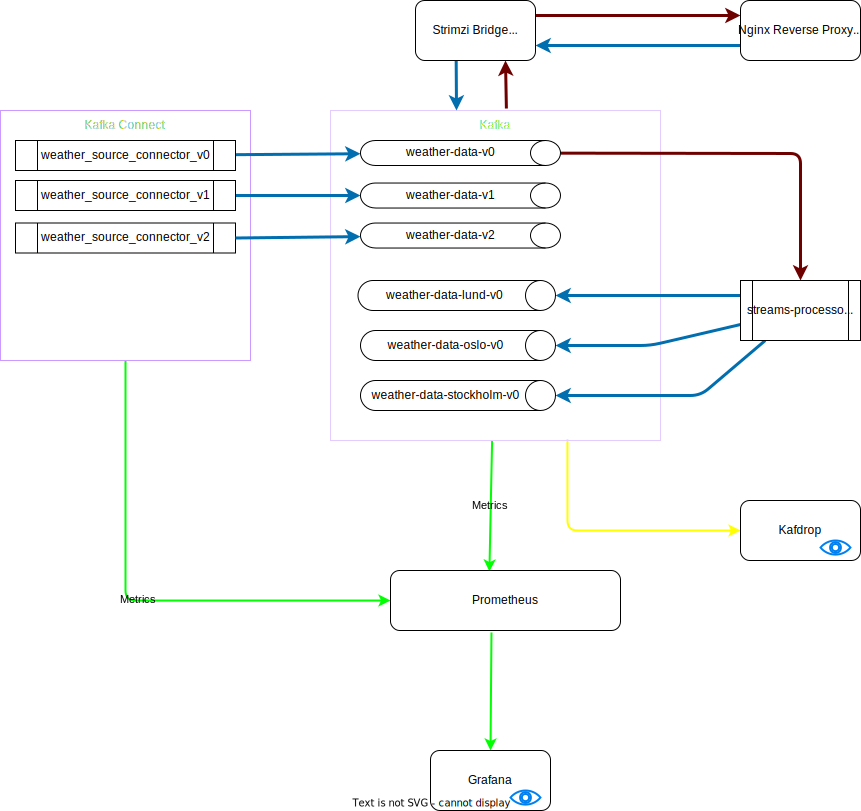

# Strimzi Playground

- [Strimzi Playground](#strimzi-playground)
  - [What is happening here?](#what-is-happening-here)
  - [Depoyment](#depoyment)
  - [Interaction](#interaction)
  - [Troubleshoot](#troubleshoot)
  - [Uninstall](#uninstall)
  - [Development](#development)
  - [Knowledge](#knowledge)

## What is happening here?



## Depoyment

1. Make sure you have docker and [kind](https://kind.sigs.k8s.io/docs/user/quick-start/#installation) installed in your machine.

2. Add the following to the end of your `/etc/hosts` file

   ```bash
   sudo nano /etc/hosts
   ```

   ```txt
   127.0.0.1     strimzi.bridge.local
   ```

3. Then run the following from the root directory of the project:

   ```bash
   make
   ```

## Interaction

You may can visualize the Kafka and other components using Grafana and Kafdrop. You may need to expose the containers to the host machine to access those. You can use the following commands for the above purpose:

```bash
# Expose Grafana
kubectl -n kafka port-forward service/grafana 31999:3000
# Expose Kafdrop
kubectl -n kafka port-forward service/demo-kafka-kafdrop 30900:9000
# Expose Prometheus
kubectl -n kafka port-forward service/prometheus 31090:9090
# Expose Kafka Connect REST endpoint
kubectl -n kafka port-forward service/kafka-connect-1-connect-api 38083:8083
```

## Troubleshoot

- In case if you got lots of Evicted pods:

   ```bash
   kubectl get pod -n kafka | grep Evicted | awk '{print $1}' | xargs kubectl delete pod -n kafka
   ```

## Uninstall

When you are finished, you can uninstall the entire deployment with the following:

```bash
helm uninstall demo-kafka -n kafka
```

You may can delete the k8s cluster as well:

```bash
kind delete cluster
```

## Development

Places that you should mention the Strimzi/Kafka versions:

1. [Kafka Connect Dockerfile](build-connect/Dockerfile)
2. [Helm chart parent values file](helm-charts/values.yaml)

## Knowledge

1. [What is Kafka?](./docs/KAFKA.md)
2. [Kafka Flavors](./docs/FLAVORS.md)
3. [What is Strimzi?](https://strimzi.io/)
4. [Key configurations for Kafka, Connect and Zookeeper](./docs/KEY-CONFIGS.md)
5. [Monitoring and Alerting](./docs/MONITORING-ALERTING.md)
6. [How Kafka Works](./docs/HOW-KAFKA-WORKS.md)
7. [Design Patterns and Use cases](./docs/DESIGN-PATTERNS.md)
8. [Unlocking Kafka's Potential: Tackling Tail Latency with eBPF](https://blog.allegro.tech/2024/03/kafka-performance-analysis.html)
