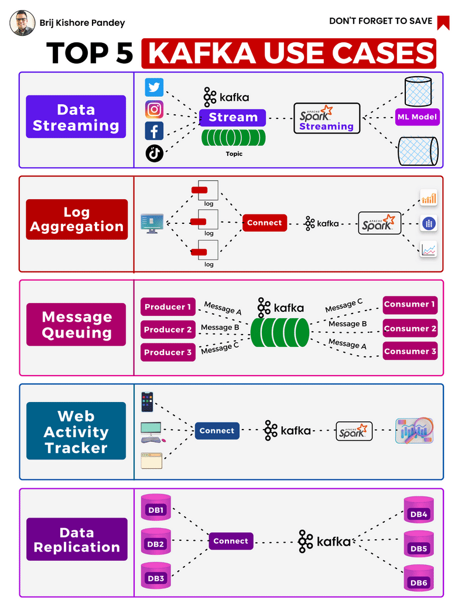

# Design Patterns & Use cases

## Design Patterns

## Use cases

## References

1. [Introducing Stream Designer: The Visual Builder for Streaming Data Pipelines](https://www.confluent.io/blog/building-streaming-data-pipelines-visually/)