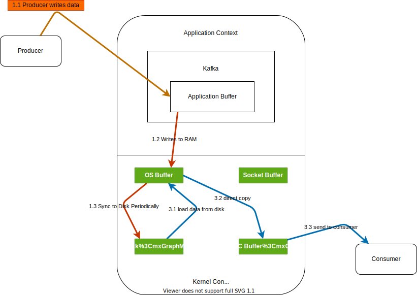

# How Kafka Works

Kafka is optimized for high throughout. It is designed to move a large number of records in a short amount of time. Think of a very large pipe moving liquid - like nord stream! The bigger the diameter of the pipe, the larger the volume of liquid that can move through it. So, Kafka is fast means it can moves a lot of data efficiently. 

## Why Kafka is fast?

### Reliance on sequential I/O
2 types of disk access pattern: (1) random (100 Kb/sec), (2) sequential (100 Mb/sec). [(2) is way more faster than (1)](#). Kafka usage sequential IO by using append only log as its primary data structure. An append only log adds new data to the end of the file. This access pattern is sequential. As HDD is cheaper than SSD, Kafka can store a huge volume of messages with a low cost.

### Efficiency: 
kafka moves a lots of data from network to disk and disk to network. It is critically important to eliminate excess copy. This is where the `zero copy principle` comes into the picture. Moderm Unix systems are highly optimized to transfer data from disk to network without copying data excessively. 

1st, The data page is loaded from the disk to the OS cache. With zero copy, the Kafka Application uses a system call called sendfile() to tell the operating system to directly copy the data from the OS cache to the network interface card buffer. In this optimized path, the only copy is from the OS cache into the network card buffer. With a modern network card, this copying is done with DMA (Direct Memory Access). When DMA us used, the CPU is not involved - making it even more efficient!

## References
1. [System Design: Why is Kafka fast?](https://www.youtube.com/watch?v=UNUz1-msbOM&t=133s)