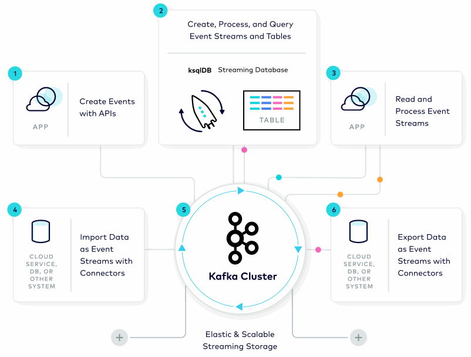
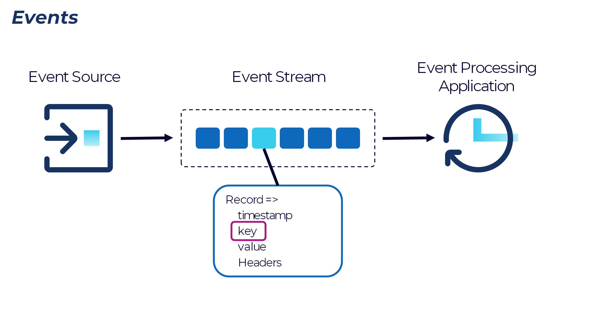
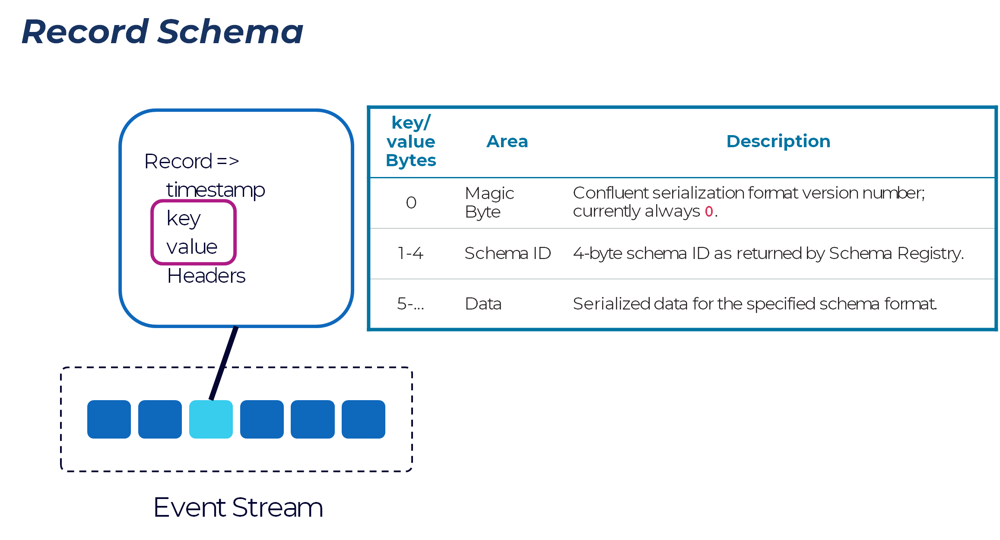
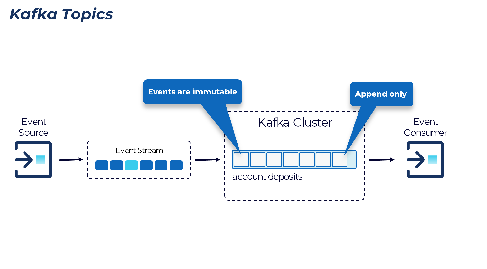
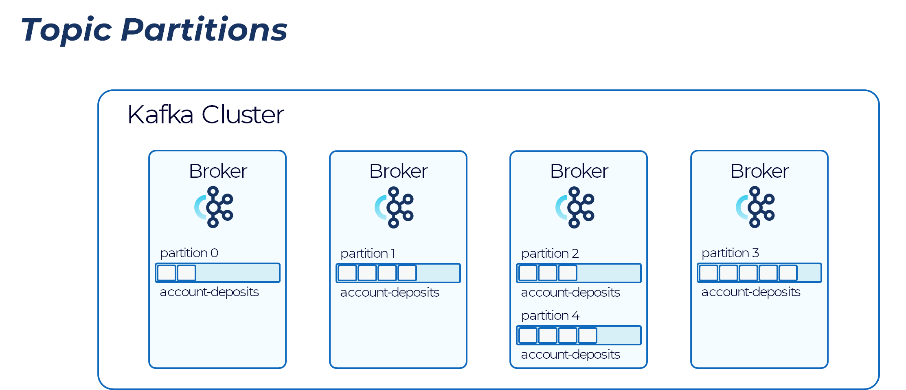
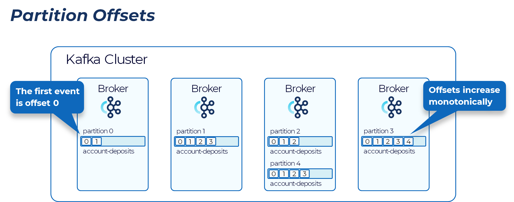
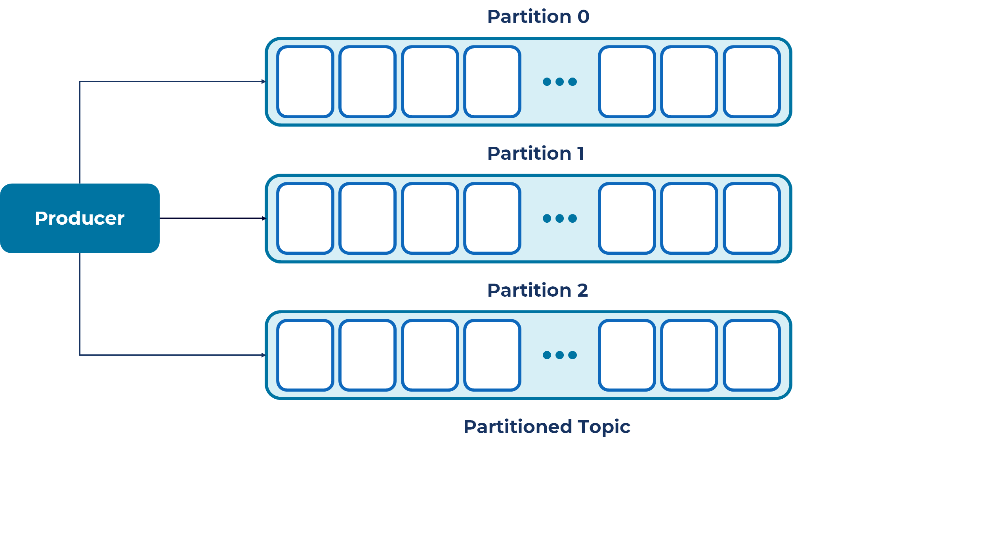
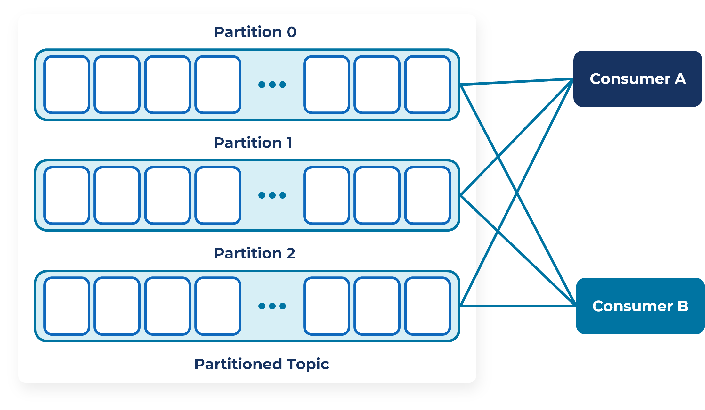
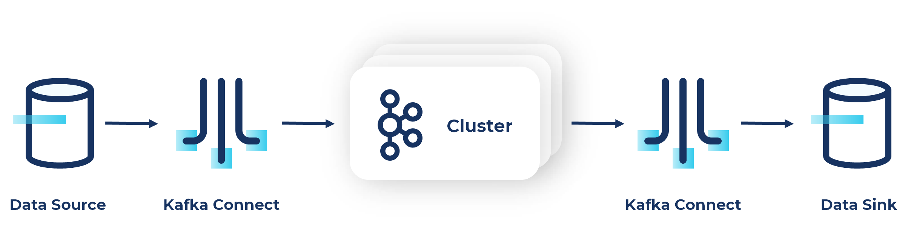

# Kafka Overview

## Kafka
Apache Kafka is a community distributed streaming platform capable of handling trillions of events a day. Kafka is based on an abstraction of a distributed commit log. Since being created and open sourced by LinkedIn in 2011, Kafka has quickly evolved from messaging queue to a full-fledged streaming platform.

Its key strength is its ability to make high volume data available as a real-time stream for consumption in systems with very different requirements – from batch systems like Hadoop, to real-time systems that require low-latency access, to stream processing engines that transform data streams immediately, as they arrive.

Core of Kafka is the storage layer. Designed as a distributed system. Two APIs to access the storage, one for writes and the other for reads. On top of that, we build two additional APIs: connection for integration and kstreams/ksql for processing. 

- Kafka’s design separates the storage layer from the compute layer.
- The storage layer includes brokers (servers) that make up the Kafka Cluster.
- The compute layer includes clients that create events, and that read and process these events.
- These clients include the streaming database ksqlDB, applications that use the Kafka - - - Streams client library, and Kafka connectors

## Events

A topic is a container that typically group events of same type together, like a DB table, order, clicks, impressions, etc. During write, specify which topic. During read, subscribe based on topic for filtering on consumption. Topic can be configured independently, e.g. how long to retain. Kafka topics are named containers of a sequence of related events, e.g., “customer orders”, “customer account deposits”, “customer account balance updates”, and so on … Topic defines a logical queue. Consumption at topic level.

The topic is Kafka’s most fundamental unit of organization. As a developer using Kafka, the topic is the abstraction you probably think the most about.

- Kafka clusters typically contain many topics.
- Consumers generally subscribe at the topic level
- Topics take the form of a log and as such are easy to understand, because they are simple data structures with well-known semantics.
- A topic is append only: When you write a new event into a topic, it always goes on the end.
- Second, a topic can only be read by seeking an arbitrary offset, then by scanning sequential entries.
- Third, events in the topic are immutable—once something has happened, it is exceedingly difficult to make it un-happen.

The simple semantics make it feasible for Kafka to deliver high levels of sustained throughput in and out of topics, and also make it easier to reason about the replication of topics. Kafka topics are also fundamentally durable things. Traditional enterprise messaging systems have topics and queues, which store events temporarily to buffer them between source and destination. 

Since Kafka topics are logs, there is nothing inherently temporary about the data in them. Every topic can be configured to expire data after it has reached a certain age (or the topic overall has reached a certain size), from as short as seconds to as long as years or even to retain events indefinitely. The logs that underlie Kafka topics are files stored on disk. When you write an event to a topic, it is as durable as it would be if you had written it to any database you ever trusted.

## Record Schema

Both key/value are byte arrays. Applications have the flexibility of how to encode the data.

When the record key or value are serialized with a Confluent Schema Registry compatible serializer, the first byte of the serialized data is the magic byte which identifies the the serialization format version. Integrating with Confluent Schema Registry allows data to be encoded with JSON or Avro.

The next four bytes contain the schema ID under which the schema was registered in the Schema Registry.

The consumer client requests the schema from the Schema Registry using this schema ID and then deserializes the key or value using that schema.

## Topic 

A topic is a container that typically group events of same type together, like a DB table, order, clicks, impressions, etc. During write, specify which topic. During read, subscribe based on topic for filtering on consumption. Topic can be configured independently, e.g. how long to retain. Kafka topics are named containers of a sequence of related events, e.g., “customer orders”, “customer account deposits”, “customer account balance updates”, and so on … Topic defines a logical queue. Consumption at topic level.

The topic is Kafka’s most fundamental unit of organization. As a developer using Kafka, the topic is the abstraction you probably think the most about.

- Kafka clusters typically contain many topics.
- Consumers generally subscribe at the topic level
- Topics take the form of a log and as such are easy to understand, because they are simple data structures with well-known semantics.
- A topic is append only: When you write a new event into a topic, it always goes on the end.
- Second, a topic can only be read by seeking an arbitrary offset, then by scanning sequential entries.
- Third, events in the topic are immutable—once something has happened, it is exceedingly difficult to make it un-happen.

The simple semantics make it feasible for Kafka to deliver high levels of sustained throughput in and out of topics, and also make it easier to reason about the replication of topics. Kafka topics are also fundamentally durable things. Traditional enterprise messaging systems have topics and queues, which store events temporarily to buffer them between source and destination. 

Since Kafka topics are logs, there is nothing inherently temporary about the data in them. Every topic can be configured to expire data after it has reached a certain age (or the topic overall has reached a certain size), from as short as seconds to as long as years or even to retain events indefinitely. The logs that underlie Kafka topics are files stored on disk. When you write an event to a topic, it is as durable as it would be if you had written it to any database you ever trusted.

## Topic Partitions

Since Kafka runs as a distributed system, we need a way to distribute the data in a topic to the cluster. Partition is the unit of distribution. Each partition’s data is stored on a single broker. There are typically many partitions for load balancing. Partition is also the unit and parallelism for better scalability. A partition’s storage is typically bounded by a capacity of a single broker.

If a topic were constrained to live entirely on one machine, that would place a pretty radical limit on the ability of Kafka to scale. It could manage many topics across many machines—Kafka is a distributed system, after all—but no one topic could ever get too big or aspire to accommodate too many reads and writes.  Fortunately, Kafka does not leave us without options here: It gives us the ability to partition topics. In practice, almost all topics are partitioned.

Partitioning takes the single topic and breaks it into multiple topic partitions, each of which can live on a separate node in the Kafka cluster. This way, the work of storing events, writing new events, and processing existing events can be split among many nodes in the cluster.

## Partition Offsets

Each event in a partition has a unique identifier, called offset. It’s monotonically increasing and never reused. Consumer typically asks for new events from an offset. Events delivered to consumer in offset order. Offsets are logical id of records. When events are written to a partition, they are assigned an offset identifying the logical position within the partition.

- Partitions and offsets allow efficient offset management.
- The first event written to each partition is assigned offset 0
- Subsequent events written to partitions are assigned the next corresponding offset for that partition

## Producers and Consumers

All right, now let's get outside of the Kafka cluster proper, that group of brokers that are doing all that replication, and partition management, and pub-subbing, and all the stuff that they do.

Let's get outside of there to think about the applications that use Kafka: producers and consumers. This is where we spend most of our time as developers, because these are client applications. Now, this is code that you write. They put messages into topics, and they read messages out of topics.

Every component of the Kafka platform that is not a Kafka broker is at bottom either a producer, or a consumer, or both. Producing and consuming is how you interface with the cluster.

### Producers

Let's zero in on producers first. Now, the API surface of the producer library is fairly lightweight. In Java, which is the native language of Apache Kafka, there's a class called KafkaProducer that you use to connect to the cluster.

Producers publish data to the topics of their choice. The producer is responsible for choosing which record to assign to which partition within the topic. This can be done in a round-robin fashion for load balancing or it can be done according to some semantic partition function (e.g., based on some key in the record).

### Consumers

Consumers label themselves with a consumer group name, and each record published to a topic is delivered to one consumer instance within each subscribing consumer group. Consumer instances can be in separate processes or on separate machines.

If all the consumer instances have the same consumer group, then the records will effectively be load balanced over the consumer instances.

If all the consumer instances have different consumer groups, then each record will be broadcast to all the consumer processes.

A two-server Kafka cluster hosting four partitions (P0-P3) with two consumer groups. Consumer group A has two consumer instances and group B has four.

Generally topics have a small number of consumer groups, one for each “logical subscriber”. Each group is composed of many consumer instances for scalability and fault tolerance. In this publish-subscribe scenario, the subscriber is a cluster of consumers instead of a single process.

The way consumption is implemented in Kafka is by dividing up the partitions in the log over the consumer instances so that each instance is the exclusive consumer of a “fair share” of partitions at any point in time. This process of maintaining membership in the group is handled dynamically by the Kafka protocol. If new instances join the group they will take over some partitions from other members of the group. If an instance dies, its partitions will be distributed to the remaining instances.

Kafka only provides a total order over records within a partition, not between different partitions in a topic. Per-partition ordering combined with the ability to partition data by key is sufficient for most applications. However, if you require a total order over records this can be achieved with a topic that has only one partition, though this will mean only one consumer process per consumer group.

## Kafka Connect

Now it is a fact in the world of information storage and retrieval that some systems are not Kafka. Some say that's an unfortunate fact, but we all agree at minimum that it is true. And sometimes you'd like the data that are in those other systems to get into Kafka topics. And sometimes you'd like the data in Kafka topics to get into those systems. This is the job of Kafka Connect. Kafka is integration API, and really subs system.

Connect is on the one hand, an ecosystem of pluggable connectors. On the other hand, it's a client application that is to a Kafka cluster Connect looks like a producer or a consumer or both because remember everything that's not a broker is one of those things. So ecosystem of pluggable connectors, client application.

As a client application Connect is a server process that runs on hardware independent of the Kafka brokers themselves. This is an application running outside the cluster.

It is designed to be scalable and fault tolerant, meaning you can run not just one single connect worker but you can have a cluster of Connect workers of, of individual nodes, individual instances running the Connect process to share the load of moving data in and out of Kafka between Kafka and these external systems.

- Pluggable software component
   - A Connect worker, which is one of these nodes and the connect cluster runs one or more connectors and connector kind of gets two different senses here. Also a connector is a pluggable component.

- Interfaces to external system and to Kafka
   - That's responsible for interfacing with that external system. And in its simplest definition, a connector is a jar file with all of that, that JVM connect code in it. So it's that component.

- Source connectors act as producers
   - A source connector reads data from an external system and produces it to a Kafka topic.

- Sink connectors act as consumers
   - A sink connector, subscribes to one or more Kafka topics and then writes those messages. The messages that that reads from Kafka writes them to an external system.

Each connector is either a source or a sink connector but it's worthwhile to remember that the Kafka cluster only sees a producer or a consumer in either case that's all you can be to Kafka. So if you're producing that means you're a source connector. If you're consuming, that means you're a sink connector.

One of the primary advantages of connect is the gigantic ecosystem of connectors that someone else has written. And maybe lots of people have deployed and tested writing the code that moves data to a cloud Blobstore or writes it to elastic search or inserts records into a relational database or whatever that's code that is, we'll say unlikely to vary from one business to the next way. Everybody does that in the same way that does not differentiate you to write that code. Likewise, reading from relational database, getting messages from salesforce.com a legacy HDFS file system or something like that. That's the same operation no matter what sort of application does it, you can definitely write this code if it's fun and nobody's looking, but spending your time doing that doesn't add any kind of unique value to your customers or make your business more uniquely competitive. It's what we call undifferentiated code. And when you can avoid writing that kind of code, you should.

## References
1. [Kafka Fundamentals](https://developer.confluent.io/learn-kafka/architecture/get-started/)